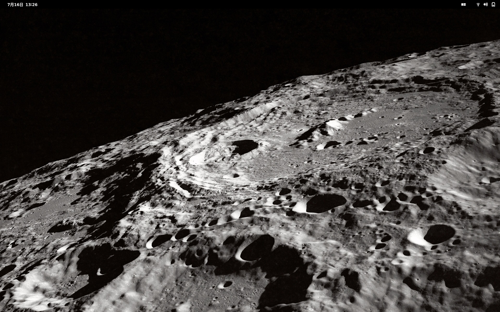

# dotfiles: Pop!_OS

[Install guide](INSTALL.md) | [TODO](TODO.md)

Welcome to the Pop!_OS branch. Other branches:
- Main: https://alex-reaves/dotfiles/

## Contents

- `setup.sh`: A script to set up the desktop. It runs:
	1. `install.sh`: Installs packages & projects.
		- Packages:
      		- `gnome-session` (vanilla gnome)
      		- {TODO}
		- Projects:
			- [Firefox GNOME Theme](https://github.com/rafaelmardojai/firefox-gnome-theme)
			- {TODO}
	2. `configure.sh`: Sets up packages & projects.
